**Java学习之路**
----------------

**设计模式**
------------

## 设计模式原则

- 对接口编程,而不是具体的实现
- 多用组合,少用继承
- 将不变的封装在一起.将变化的抽离出来,抽象成公共的部分

## 设计模式图解

### 策略模式



### 观察者模式



**目录结构**
------------

```
├──basic 基础学习
   ├──IO流   
      ├── 字节流
      ├── 字符流
   ├──Jvm   java虚拟机
   ├──passby  java只有引用传递
   
├──designpattern 设计模式
   ├──lesson1  策略模式
      ├──partnerone  鸭子不会飞
      ├──partnertwo  骑士的弓箭
   ├──lesson2  装饰者模式
      ├──origin 基础模板
      ├──broadcast 我要开播了
   ├──lesson3  
   ├──
├──effectivejava 
   ├──lesson7  清除无效的引用
├──
```
